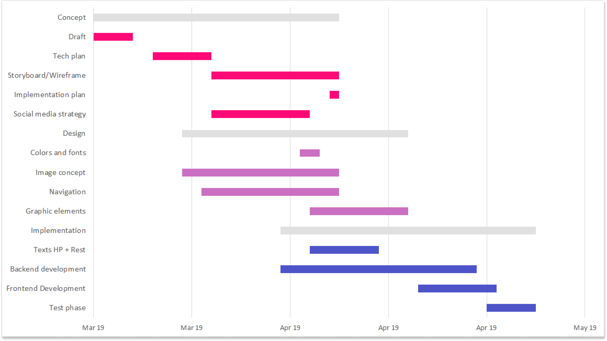
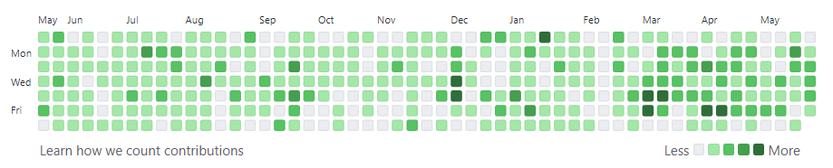
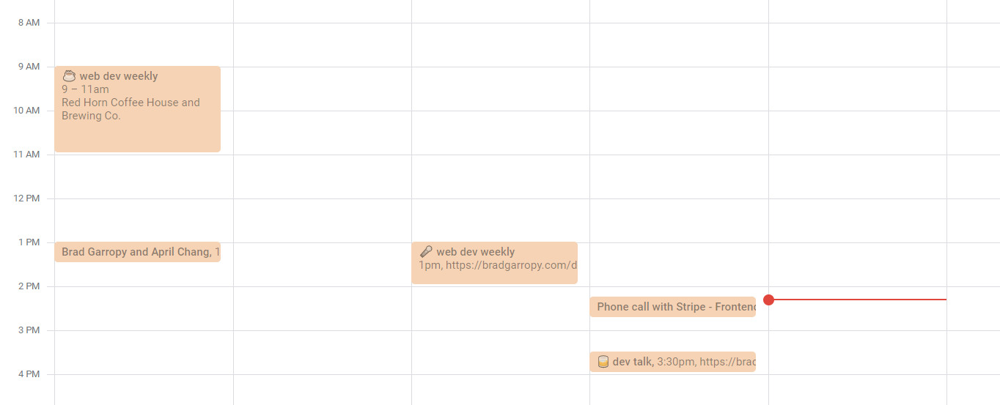
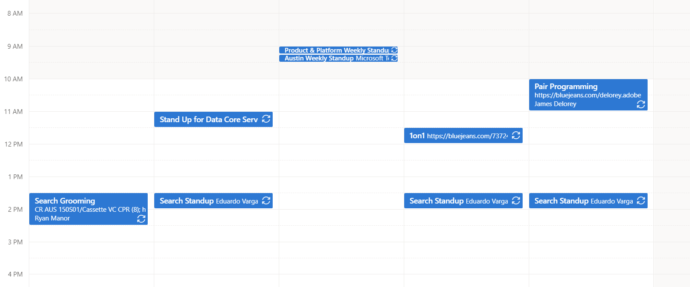

# Airtable Timeline

[![airtable timeline][thumbnail]][video]

_This was a great interview question, it was both fun and challenging! I wrote this timeline with no libraries except [react][react] and [date-fns][date-fns]. I used my personal [prettier][prettier] and [eslint][eslint] configurations._

## ⏰ Time Spent

I worked on this project for around an hour each night over the past week. So I'd say 4-6 hours.

### 😍 What I Like About It

I thought my strategy of laying out the timeline events on a `grid` with `grid-column` and `grid-row` was pretty clever, especially the grid lines. The zoom feature works quite well by simply adjusting the `start` and `end` dates of the timeline in response to scroll events. Even though I had limited time to work on this project, I'm happy that I finished basic CRUD functionality for the timeline events.

### 😢 What Could Be Improved

There's so much that can be improved if I had more time!

The most obvious addition would be dates on the x axis to provide better context. Another great improvement would be drag and drop editing of the date, which can easily be done with the [Drag and Drop API][dnd]. One thing I wanted to implement was a scrubbable timeline, so users can move forward or backwards in the timeline.

Being a proof of concept, the timeline could look much better. I'd like to have the edit modal placed relative to the timeline event it's associated with, rather than absolutely positioned on the page. The modal should also support key events, like `escape` to close, and focus capture.

Although I used my a11y lint rules, I'm sure the timline's accessibility could be improved by adding `role`, `tab-index`, and `aria-label` tags in addition to keyboard navigation.

The data set for this timeline could get very big, and I should improve the performance of the timeline. Right now, all events are being loaded into `context`, but ideally, I would only be pulling in events that are included in the current timeline scope, and some that are just outside the scope to improve user experience. Think infinite scrolling, but for nearby timline events (assuming we had an API that supports it).

And finally, while I used a few css variables, there could be lots of improvements to the css like adding more design tokens.

### 🤔 Design Decisions

While considering designing the timeline, I looked at a few different sources for inspiration.

-   Gantt charts
-   GitHub contributions
-   Google calendar
-   Outlook calendar

Ultimately I based my implementation on the GitHub contribution graph, but made it look more like a traditional Gantt chart.

### 🧪 How I Would Test

While I did use [TypeScript][typescript] to ensure type safety, I didn't get to implementing any real tests. If I had all the time in the world I would start with some basic [Jest][jest] unit and snapshot tests, then progress to [Cypress][cypress] end to end testing, and finally [Storybook][storybook] and [Chromatic][chromatic] for component level visual testing.

[thumbnail]: images/thumbnail.png
[video]: https://youtu.be/d6oh5qrw5bE
[react]: https://reactjs.org
[date-fns]: http://date-fns.org
[prettier]: https://github.com/bradgarropy/dotfiles/blob/master/.prettierrc
[eslint]: https://github.com/bradgarropy/eslint-config
[dnd]: https://developer.mozilla.org/en-US/docs/Web/API/HTML_Drag_and_Drop_API
[airtable]: images/airtable.png
[gantt]: images/gantt.png
[github]: images/github.png
[google]: images/google.png
[outlook]: images/outlook.png
[typescript]: https://www.typescriptlang.org
[jest]: https://jestjs.io
[cypress]: https://www.cypress.io
[storybook]: https://storybook.js.org
[chromatic]: https://www.chromatic.com
